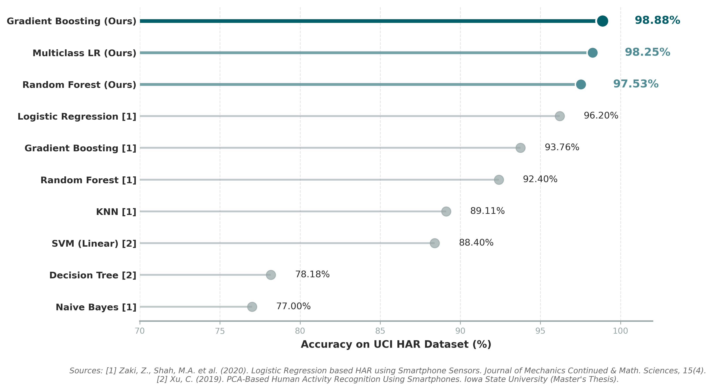
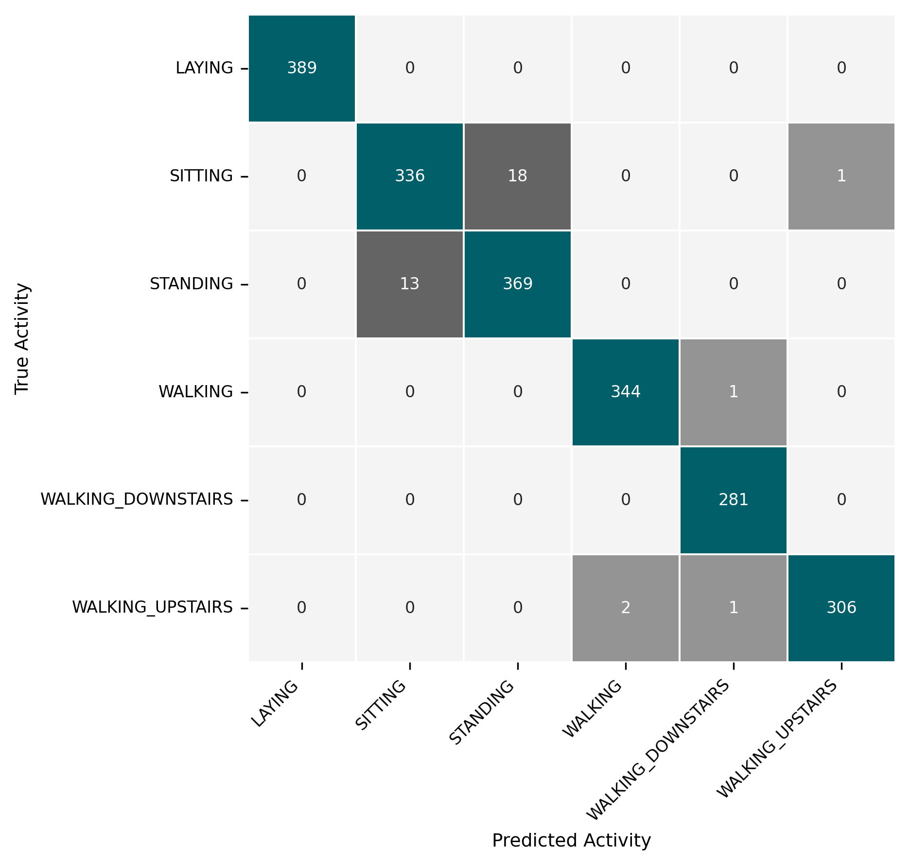
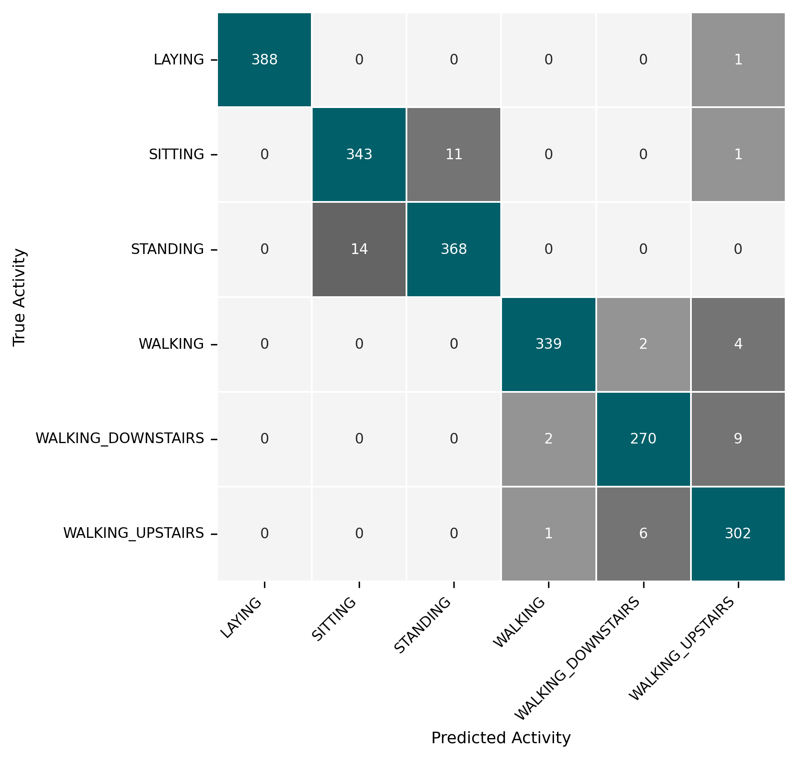
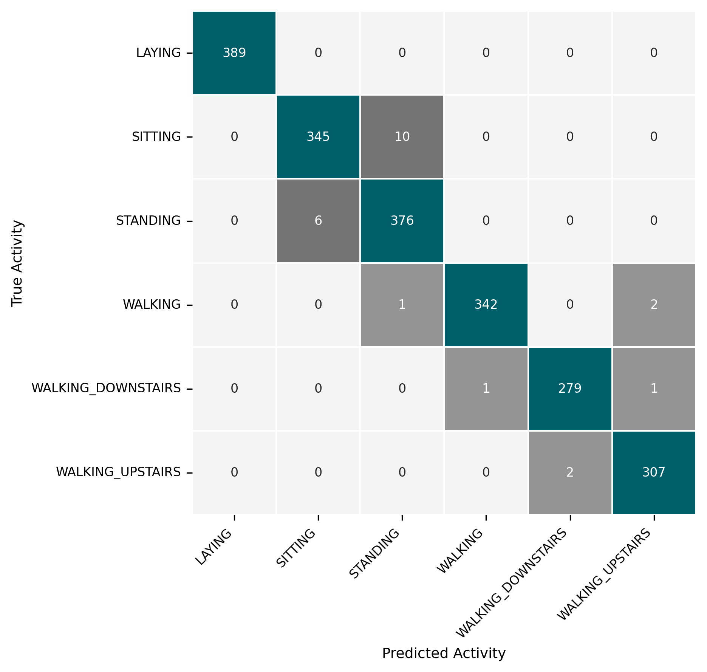

# Human Activity Recognition Using Smartphones: Multi-Model Analysis

A machine learning project for classifying human activities using smartphone sensor data, comparing Logistic Regression, Random Forest, and Gradient Boosting approaches.

## Overview

This project uses the UCI Human Activity Recognition (HAR) Dataset to classify six different human activities based on accelerometer and gyroscope sensor data from smartphones. The study provides a comprehensive comparison across three model families: linear (Logistic Regression), bagging (Random Forest), and boosting (Gradient Boosting).

### Activities Classified
- WALKING
- WALKING_UPSTAIRS
- WALKING_DOWNSTAIRS
- SITTING
- STANDING
- LAYING

### Key Results

| Model | Features/Components | Test Accuracy | Notes |
|-------|---------------------|---------------|-------|
| **Multinomial LR (Baseline)** | 561 features | **98.25%** | Linear model with L2 regularization |
| **PCA(200) + LR** | 200 components | 97.77% | 2.8x feature reduction |
| **PCA(104) + LR** | 104 components | 97.14% | 5.4x feature reduction |
| **Random Forest** | 561 features | 97.53% | 300 trees, OOB: 97.60% |
| **Gradient Boosting** | 561 features | **98.88%** | 200 stages, max_depth=3 |

All models substantially outperform literature baselines (Zaki et al. 2020: LR 96.20%, RF 92.40%, GB 93.76%), confirming that rigorous preprocessing is the primary driver of performance.

## Dataset

The [UCI HAR Dataset](https://archive.ics.uci.edu/ml/datasets/human+activity+recognition+using+smartphones) contains sensor readings from 30 volunteers (aged 19--48) performing six activities while wearing a Samsung Galaxy S II smartphone on the waist.

**Dataset Characteristics:**
- **Subjects:** 30 volunteers
- **Sensors:** 3-axial accelerometer and gyroscope
- **Sampling Rate:** 50 Hz
- **Total Samples:** 10,299 activity recordings
- **Features:** 561 time and frequency domain features
- **Window Size:** 2.56 seconds with 50% overlap (128 readings/window)

## Project Structure

```
Human Activity Recognition/
├── src/
│   ├── prepare_data.py                     # Data loading, standardization, splitting
│   └── utils.py                            # Feature name cleaning, grouping
├── models/
│   ├── logistic_regression/
│   │   └── notebooks/
│   │       └── PCA_LogReg_HAR.ipynb       # LR + PCA analysis
│   ├── random_forest/
│   │   └── notebooks/
│   │       └── RF_HAR.ipynb               # RF analysis
│   └── gradient_boosting/
│       └── notebooks/
│           └── GB_HAR.ipynb               # GB analysis
├── requirements.txt
└── README.md
```

## Installation

### Prerequisites
- Python 3.8 or higher
- pip package manager

### Setup

1. Clone this repository:
```bash
git clone https://github.com/batuhne/Human-Activity-Recognition.git
cd Human-Activity-Recognition
```

2. Create a virtual environment (recommended):
```bash
python -m venv venv
source venv/bin/activate  # On Windows: venv\Scripts\activate
```

3. Install dependencies:
```bash
pip install -r requirements.txt
```

4. Download the UCI HAR Dataset:
   - Download from [UCI Machine Learning Repository](https://archive.ics.uci.edu/ml/datasets/human+activity+recognition+using+smartphones)
   - Extract to project root as `UCI HAR Dataset/`

5. Generate processed data:
```bash
python src/prepare_data.py
```

## Usage

### Data Preparation

```bash
python src/prepare_data.py
```
Creates `outputs/processed/` with standardized `.npz` splits and `feature_groups.json`.

### Model Notebooks

```bash
# Logistic Regression + PCA analysis
jupyter lab models/logistic_regression/notebooks/PCA_LogReg_HAR.ipynb

# Random Forest analysis
jupyter lab models/random_forest/notebooks/RF_HAR.ipynb

# Gradient Boosting analysis
jupyter lab models/gradient_boosting/notebooks/GB_HAR.ipynb
```

## Methodology

### Pipeline Overview

```
Raw Sensor Data (561 features)
        |
StandardScaler Normalization (fitted on train only)
        |
Stratified Split (70/10/20)
        |
    +---+---+---+
    |       |       |
   LR      RF      GB
    |       |       |
Classification (6 classes)
```

### Models

**1. Multinomial Logistic Regression**
- L2-regularized linear model with softmax output
- Test accuracy: 98.25% with full 561 features
- Fast training and inference, fully parallelizable

**2. Random Forest**
- Ensemble of 300 decision trees with bootstrap aggregating
- Random feature subsampling (sqrt(561) ~ 23 features per split)
- Built-in OOB error estimation
- Parallelizable training

**3. Gradient Boosting**
- Sequential ensemble of 200 shallow trees (max_depth=3)
- Achieves the highest test accuracy (98.88%) across all models
- Learning rate 0.1 with stochastic subsampling (80%)
- Sequential training (slower than LR and RF)

## Dependencies

Core libraries (see `requirements.txt` for complete list):
- **numpy** (2.0.2)
- **pandas** (2.3.3)
- **scikit-learn** (1.6.1)
- **matplotlib** (3.9.4)
- **seaborn** (0.13.2)
- **jupyter** (1.1.1)

**Dataset Source:** [UCI Machine Learning Repository](https://archive.ics.uci.edu/ml/datasets/human+activity+recognition+using+smartphones)

## Results

### Algorithm Comparison



### Confusion Matrices

<p>
  
  
  
</p>

## Outputs Directory Guide

All generated outputs from data preprocessing are stored in `outputs/`.

```
outputs/
└── processed/
    ├── feature_groups.json         # Feature categorization by sensor type and domain
    ├── ucihar_70_10_20_std.npz    # Standardized 70/10/20 train/val/test split
    └── ucihar_80_10_10_std.npz    # Standardized 80/10/10 train/val/test split
```

### Processed Data Files

**`ucihar_70_10_20_std.npz`** - Z-score normalized data split into 70% train / 10% validation / 20% test.
**`ucihar_80_10_10_std.npz`** - Alternative split with 80% train / 10% validation / 10% test.

Both contain: `X_train`, `X_val`, `X_test` (feature matrices of shape `(n_samples, 561)`), `y_train`, `y_val`, `y_test` (activity labels), and `feature_names` (list of 561 feature names).

**`feature_groups.json`** - Categorization of 561 features by sensor type and signal domain:
- `acc_all` (345 features) - All accelerometer-derived features
- `gyro_all` (213 features) - All gyroscope-derived features
- `time_all` (265 features) - All time-domain features
- `freq_all` (289 features) - All frequency-domain features

### Usage Examples

```python
import numpy as np

# Load the 70/10/20 split
data = np.load('outputs/processed/ucihar_70_10_20_std.npz', allow_pickle=True)

X_train = data['X_train']  # Shape: (7209, 561)
y_train = data['y_train']  # Shape: (7209,)
X_val   = data['X_val']    # Shape: (1029, 561)
X_test  = data['X_test']   # Shape: (2061, 561)
feature_names = data['feature_names']
```

```python
import json

with open('outputs/processed/feature_groups.json', 'r') as f:
    groups = json.load(f)

acc_features  = groups['acc_all']   # All accelerometer features
gyro_features = groups['gyro_all']  # All gyroscope features
time_features = groups['time_all']  # All time-domain features
freq_features = groups['freq_all']  # All frequency-domain features
```

### Notes

- All data files use **StandardScaler** normalization (zero mean, unit variance), fitted on the training set only.
- Stratified splitting ensures balanced class distribution across all splits.
- Random seed is fixed to **42** for reproducibility.
